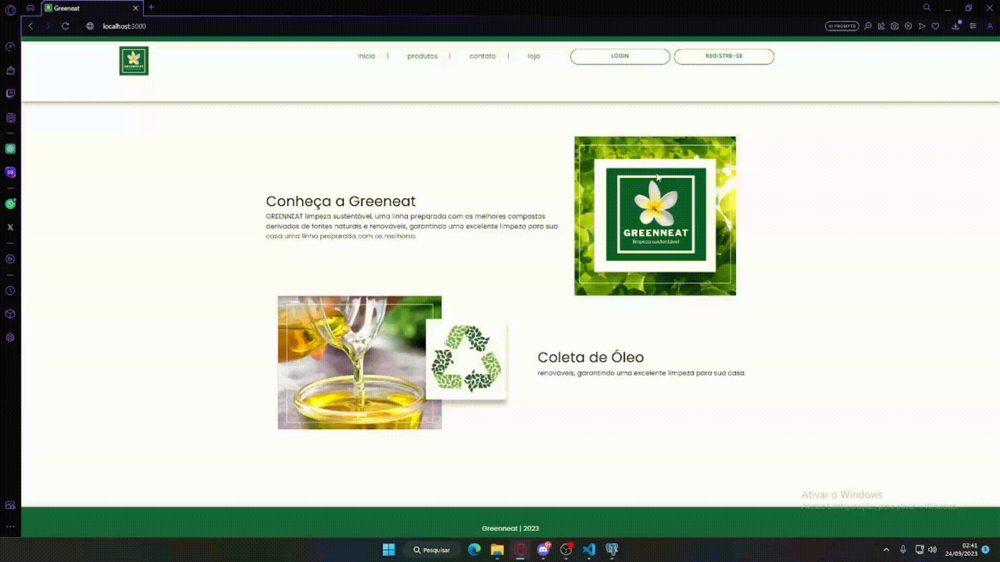

## Sprint 1 - Entrega de valor

## Resumo

 No primeiro estágio do projeto, a equipe estabelece com o cliente a entrega de um produto viável mínimo, ou seja, que tenha funcionalidade de modo a suprir minimamente suas necessidades. Dessa maneira, o grupo visou entregar um sistema de login e cadastro de usuários, podendo ser do tipo Parceiro ou Estabelecimento.

## Demonstração do Login:

## Demonstração do cadastro de parceiro:

