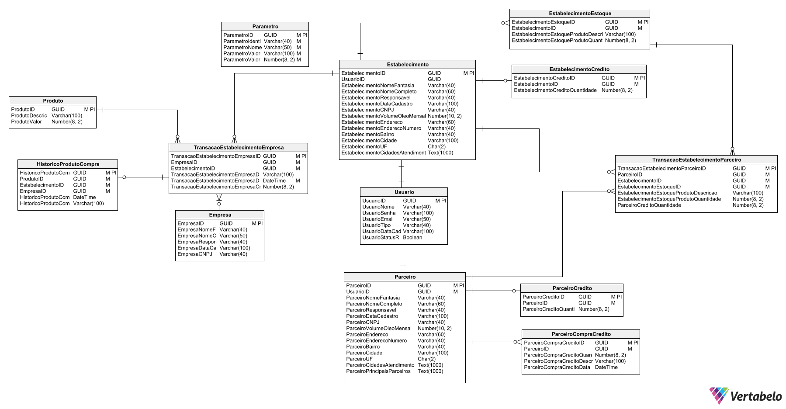

## Sprint 1 - Entrega de valor

## Resumo

 No primeiro estágio do projeto, a equipe estabelece com o cliente a entrega de um produto viável mínimo, ou seja, que tenha funcionalidade de modo a suprir minimamente suas necessidades. Dessa maneira, o grupo visou entregar um sistema de login e cadastro de usuários, podendo ser do tipo Parceiro ou Estabelecimento.

## Backlog do produto :bulb:
### Requisitos Funcionais

 • Formulário de cadastro do parceiro Greenneat. (Cooperativas, profissionaisindividuais e empresas que fazem a coleta regular do óleo). 

 • Formulário de cadastro dos estabelecimentos onde o óleo será coletado.(Restaurantes, estabelecimentos comerciais em geral, condomínios, público em geral). 

 • Sistema de login de usuário. 

### Requisitos Não-Funcionais

 • Desenvolver banco de dados para registrar informações inseridas no sistema. 

 • Desenvolver interfaces (front-end). 

 • Conexão do front-end com o back-end (Banco de dados receber e transmitir dados juntamente a aplicação em desenvolvimento). 

## Modelo conceitual banco de dados 🧩:

## Demonstração do Login 💻:

## Demonstração do cadastro de parceiro 💻:

## Demonstração do cadastro de estabelecimento 💻:

## Demonstração tela transação e extrato de Parceiro 💻:

## Demonstração tela transação e extrato de Estabelecimento 💻:

