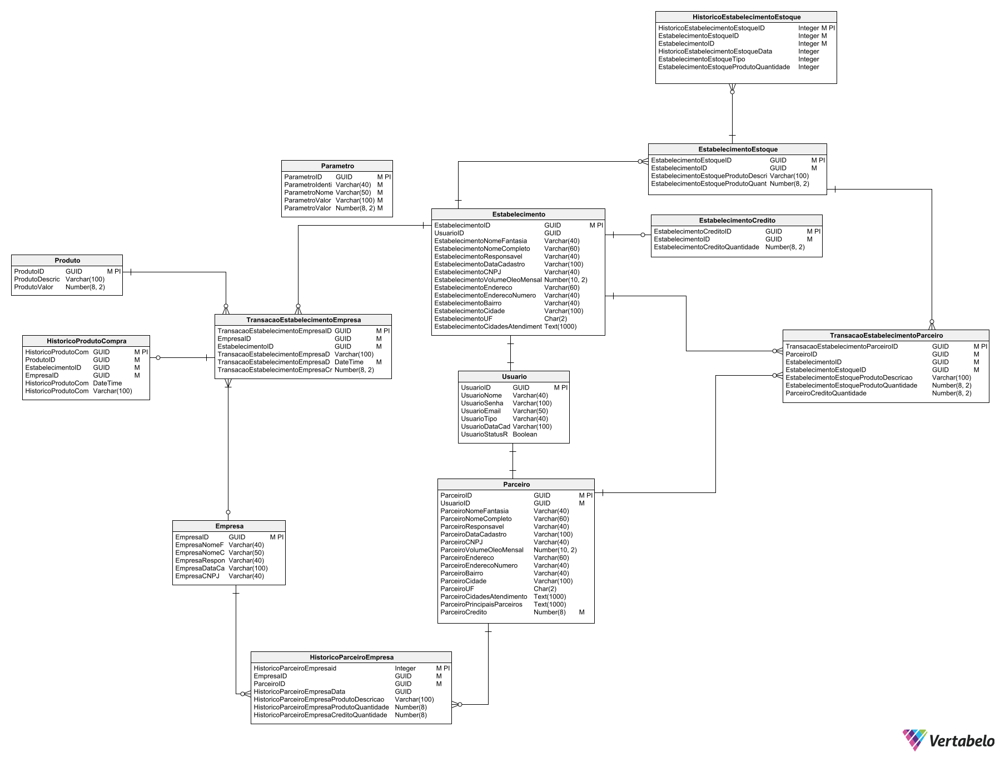
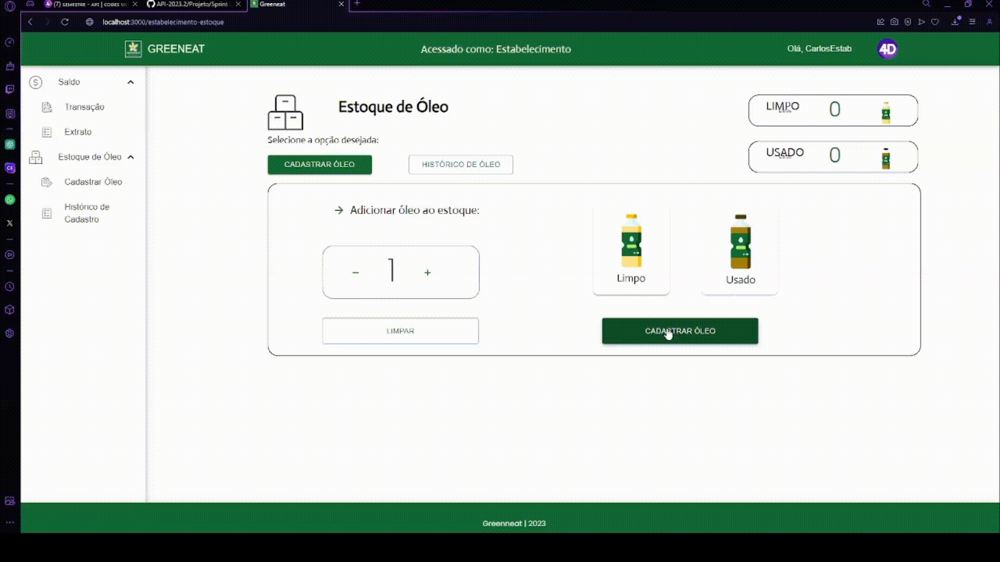
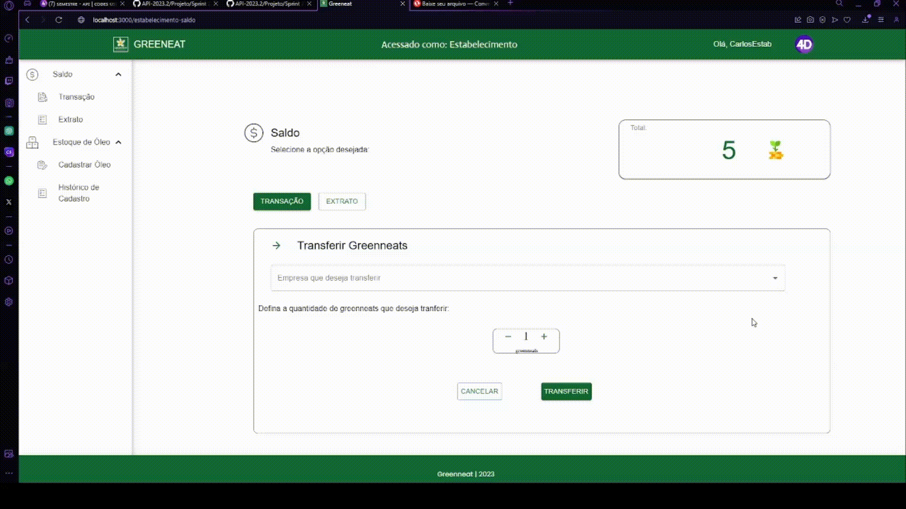
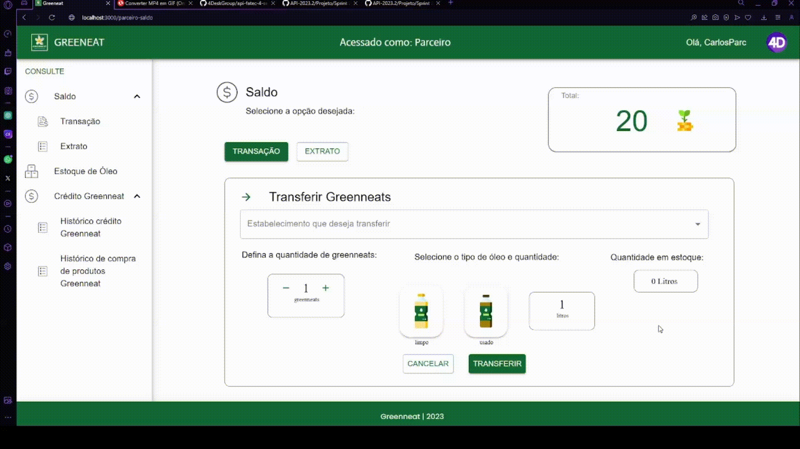
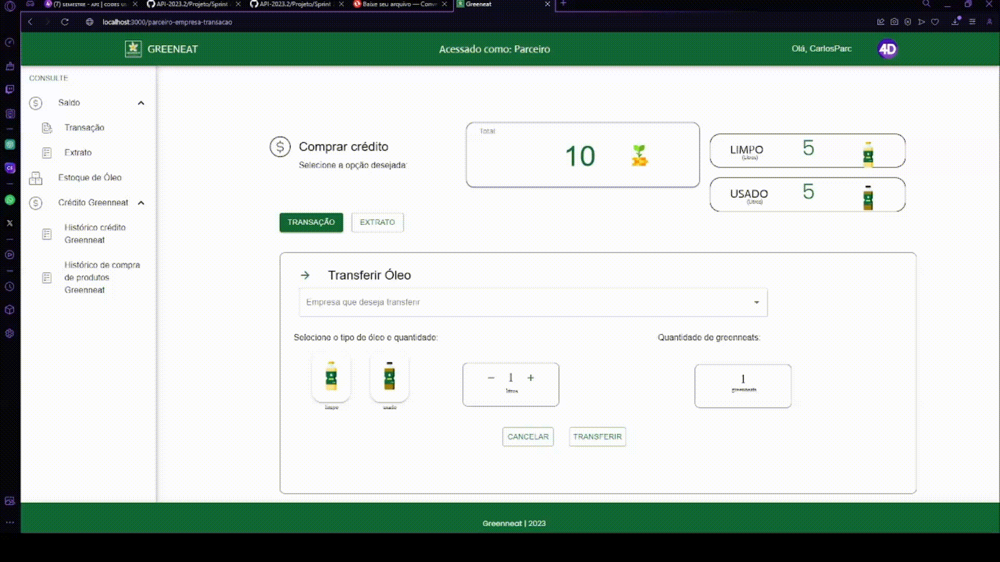
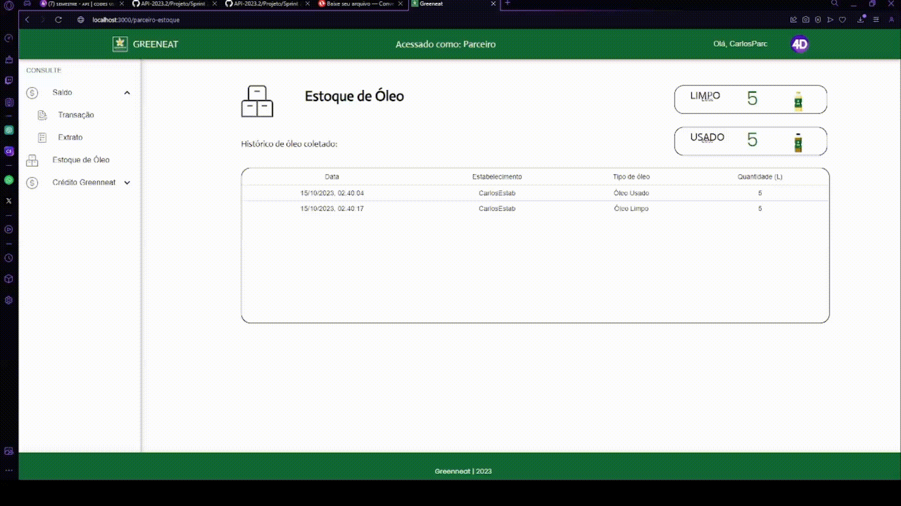

## Sprint 2 - Entrega de valor

## Resumo

 No primeiro estágio do projeto, a equipe estabelece com o cliente a entrega de um produto viável mínimo, ou seja, que tenha funcionalidade de modo a suprir minimamente suas necessidades. Dessa maneira, o grupo visou entregar um sistema de login e cadastro de usuários, podendo ser do tipo Parceiro ou Estabelecimento.

## Backlog do produto :bulb:
### Requisitos Funcionais

 • Cadastro de estoque de óleo, capacidade de cadastrar óleo sendo ele limpo ou usado no estoque do estabelecimento. (Estabelecimento). 

 • Visualização de histórico de cadastro de óleo (Estabelecimento). 

 • Transação de Grenneat(Moeda) com a empresa, capacidade de enviar Grenneats com a empresa. (Estabelecimento). 

 • Visualização do histórico de extrato feito nas transações com a Empresa (Estabelecimento). 

 • Transação entre Parceiro e Estabelecimento, capacidade de trocar Grenneats(Moeda) por óleo (Parceiro).  

 • Visualização do histórico de extrato feito na transação entre Parceiro e Estabelecimento (Parceiro).  

 • Transação entre Parceiro e Empresa, capacidade de trocar óleo por Grenneats(Moeda) (Parceiro).  

 • Visualização do histórico de extrato feito na transação entre Parceiro e Estabelecimento (Parceiro).  

### Requisitos Não-Funcionais

 • Desenvolver banco de dados para registrar informações inseridas no sistema. 

 • Desenvolver interfaces (front-end). 

 • Conexão do front-end com o back-end (Banco de dados receber e transmitir dados juntamente a aplicação em desenvolvimento). 

# 📉 Burndown

 

## User Storie: 👤:
[Baixe o arquivo XLSX](https://github.com/4DeskGroup/API-2023.2/blob/main/Projeto/Sprint%202/Gifs/User%20Story2%20API4SEM.xlsx)

## Modelo lógico banco de dados 🧩:

## Demonstração de cadastro de estoque e historico(Estabelecimento) 💻:

## Demonstração de transação de Grenneat com empresa e extrato(Estabelecimento) 💻:

## Demonstração de transação de Grenneat por óleo com estabelecimento e extrato(Parceiro) 💻:

## Demonstração de transação de óleo por Grenneat com empresa e extrato(Parceiro) 💻:

## Demonstração de historico estoque do parceiro 💻:

