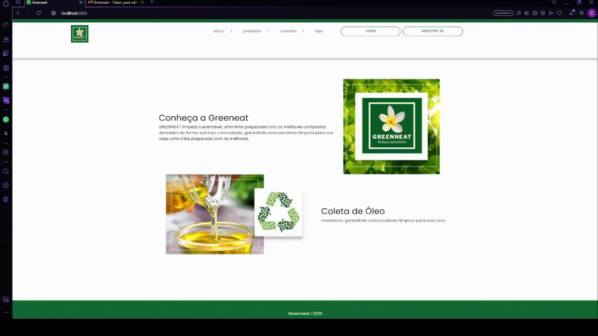

## Sprint 2 - Entrega de valor

## Resumo

 No primeiro estágio do projeto, a equipe estabelece com o cliente a entrega de um produto viável mínimo, ou seja, que tenha funcionalidade de modo a suprir minimamente suas necessidades. Dessa maneira, o grupo visou entregar um sistema de login e cadastro de usuários, podendo ser do tipo Parceiro ou Estabelecimento.

## Backlog do produto :bulb:
### Requisitos Funcionais

 • ADICIONAR. 

### Requisitos Não-Funcionais

 • Desenvolver banco de dados para registrar informações inseridas no sistema. 

 • Desenvolver interfaces (front-end). 

 • Conexão do front-end com o back-end (Banco de dados receber e transmitir dados juntamente a aplicação em desenvolvimento). 

## Burndown:chart_with_downwards_trend:

## Modelo lógico banco de dados 🧩:

## Demonstração de cadastro de estoque e historico(Estabelecimento) 💻:

## Demonstração de transação de Grenneat com empresa e extrato(Estabelecimento) 💻:

## Demonstração de transação de Grenneat por óleo com estabelecimento e extrato(Parceiro) 💻:

## Demonstração de transação de óleo por Grenneat com empresa e extrato(Parceiro) 💻:

## Demonstração de historico estoque do parceiro 💻:

