## Sprint 3 - Entrega de valor

## Resumo

 No primeiro estágio do projeto, a equipe estabelece com o cliente a entrega de um produto viável mínimo, ou seja, que tenha funcionalidade de modo a suprir minimamente suas necessidades. Dessa maneira, o grupo visou entregar um sistema de login e cadastro de usuários, podendo ser do tipo Parceiro ou Estabelecimento.

## Backlog do produto :bulb:
### Requisitos Funcionais

 • Empresa enviar moeda para parceiro (Empresa / Administrador). 

 • Visualização do histórico de transferências chegas de Grenneat(Moeda) pelos usuários (Empresa / Administrador).  

 • Visualização de estoque da empresa com o historico do mesmo (Empresa / Administrador).  

 • Transação empresa trocar óleo por Grenneat(Moeda) com parceiro(Empresa / Administrador). 

 • Visualização de todas as tranferências realizadas pelos usuários (Empresa / Administrador).  

 • Visualização dos usuários cadastrados e poder excluir / inativar um usuário (Empresa / Administrador).  

 • Transferir moedas para a empresa. (Parceiro). 

 • Visualização de histórico de moedas dadas pela empresa (Parceiro). 

 • Edição de informações do usuário logado (Parceiro e Estabelecimento).  

### Requisitos Não-Funcionais

 • Desenvolver banco de dados para registrar informações inseridas no sistema. 

 • Desenvolver interfaces (front-end). 

 • Conexão do front-end com o back-end (Banco de dados receber e transmitir dados juntamente a aplicação em desenvolvimento). 

# 📉 Burndown

 

## User Storie: 👤:
[Baixe o arquivo XLSX](https://github.com/4DeskGroup/API-2023.2/blob/main/Projeto/Sprint%203/Gifs/UserStory%20API%20Sprt%203.xlsx)

## Modelo lógico banco de dados 🧩:

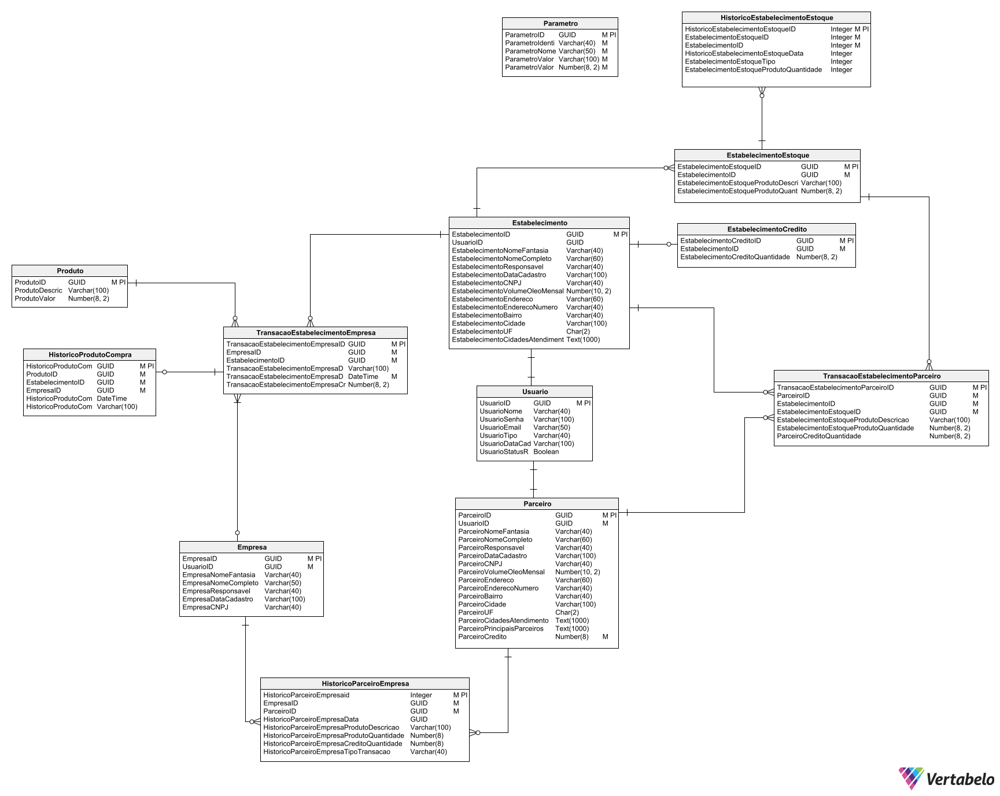

## Demonstração de empresa enviar Grenneat(Moeda) para parceiro (Empresa / Administrador) 💻:

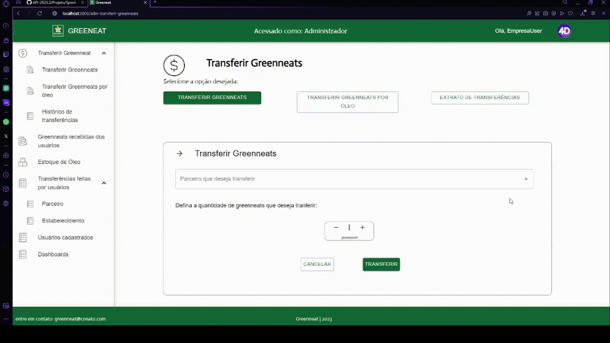

## Demonstração da visualização do histórico de transferências chegas de Greenneat(Moeda) pelos usuários (Empresa / Administrador)

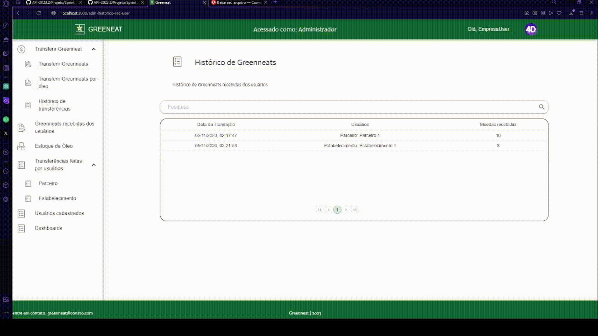

## Demonstração de transação de empresa trocar óleo por Grenneat(Moeda) com parceiro(Empresa / Administrador) 💻:

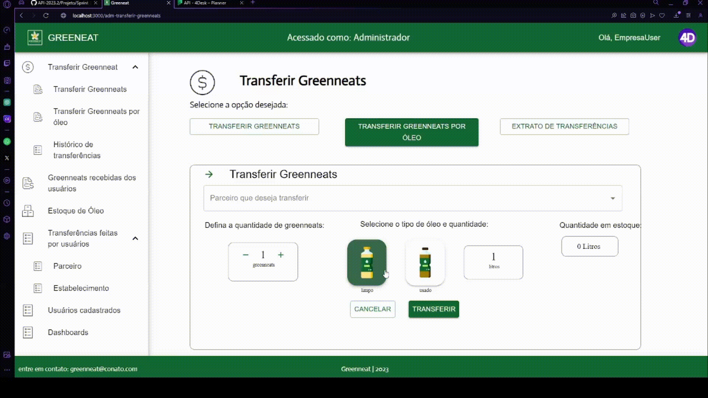

## Demonstração de estoque de Empresa(Empresa/ADM) 💻:

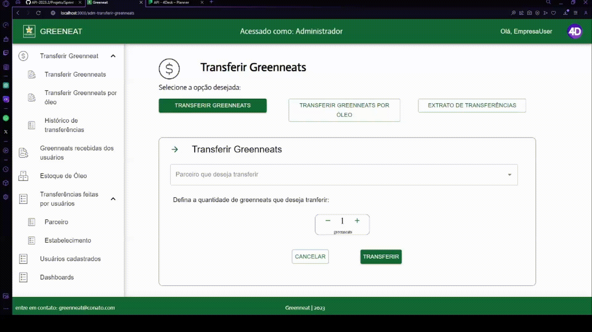

## Demonstração de transação com estoque de óleo da Empresa(Empresa / Administrador) 💻:

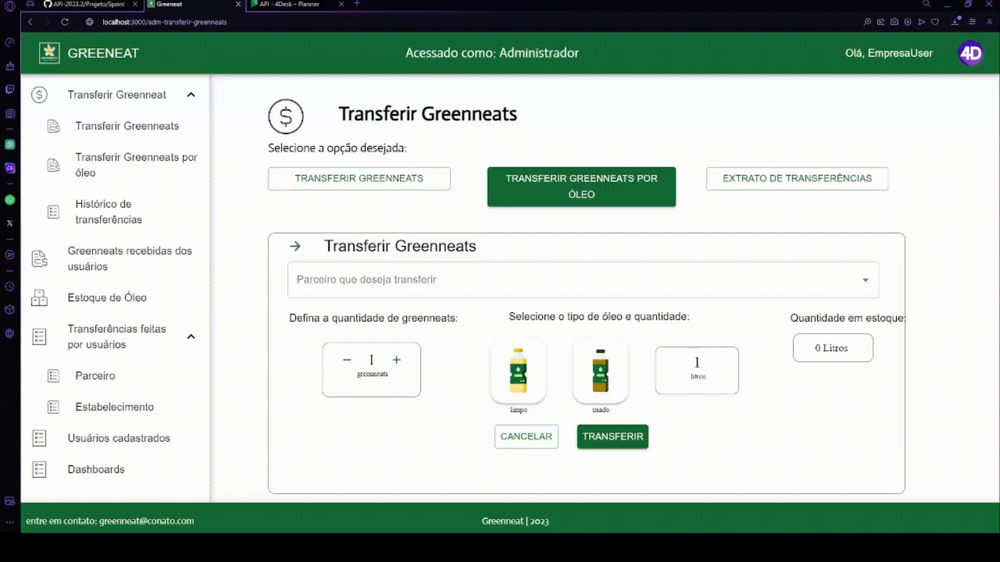

## Demonstração da visualização de todas as tranferências realizadas pelos usuários (Empresa / Administrador)

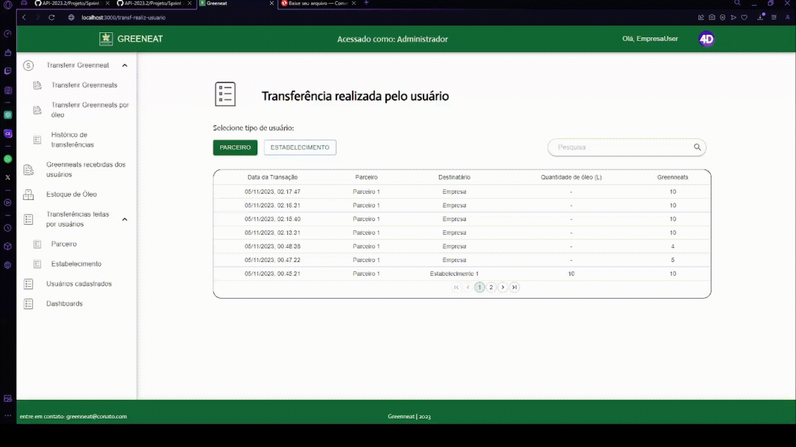

## Demonstração da visualização dos usuários cadastrados, podendo excluir / inativar um usuário (Empresa / Administrador)

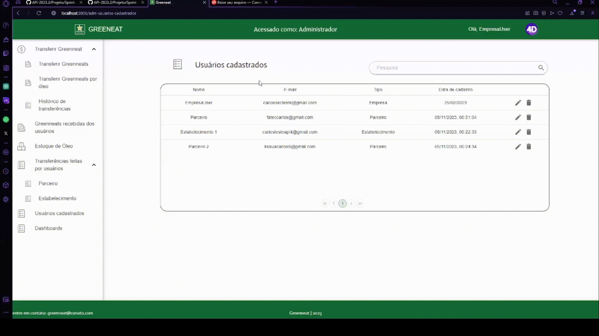

## Demonstração do histórico de transferências chegas de moedas(Greenneat) da empresa para o parceiro (Parceiro) 💻:

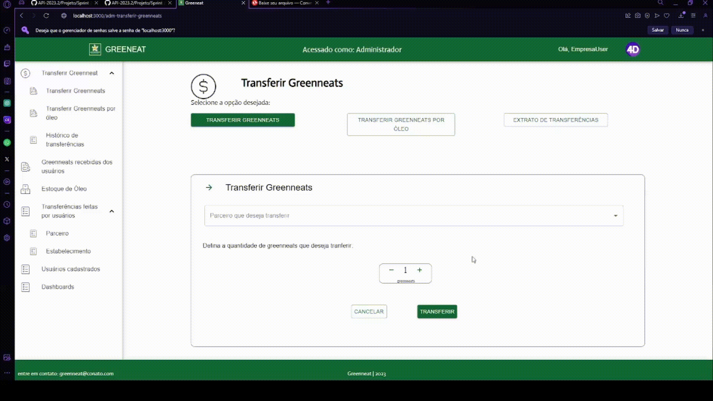

## Demonstração da transferência de moedas para a empresa e visualização do histórico (Parceiro)

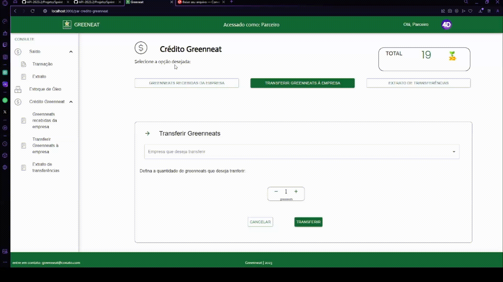

## Demonstração da edição de informações do usuário logado (Parceiro e Estabelecimento)

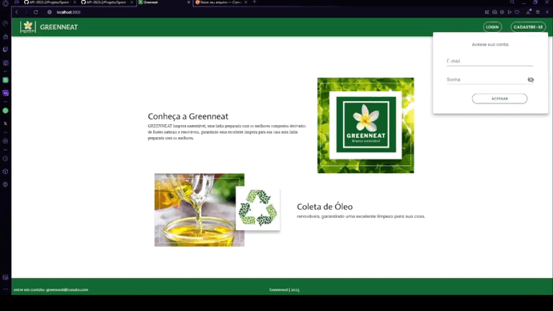
