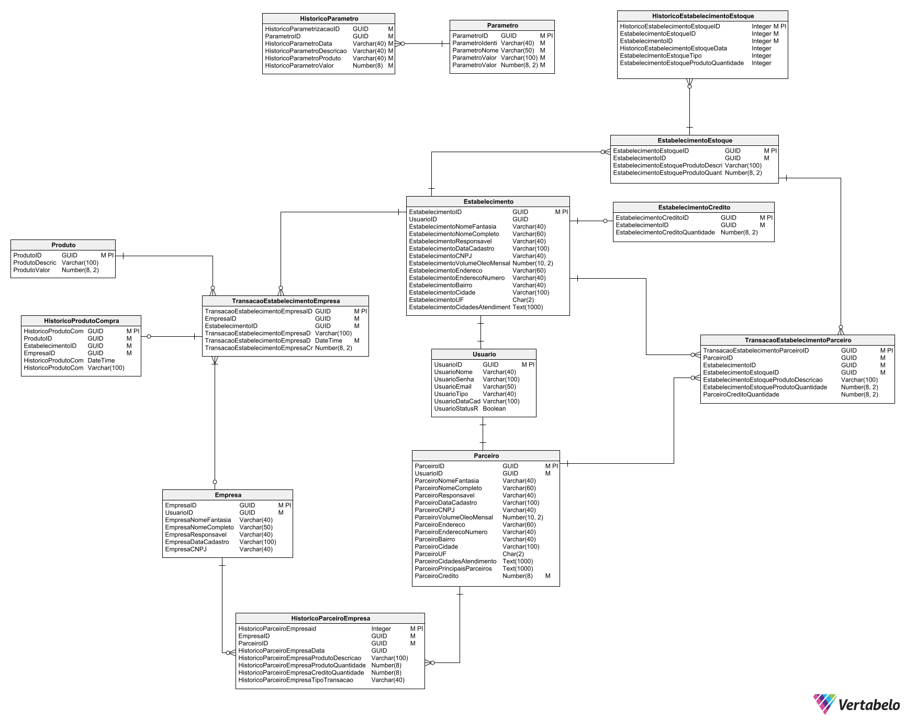
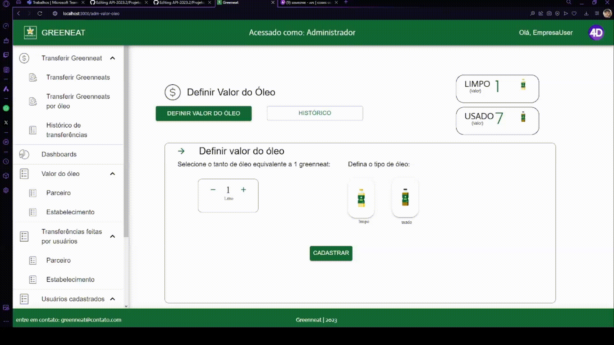
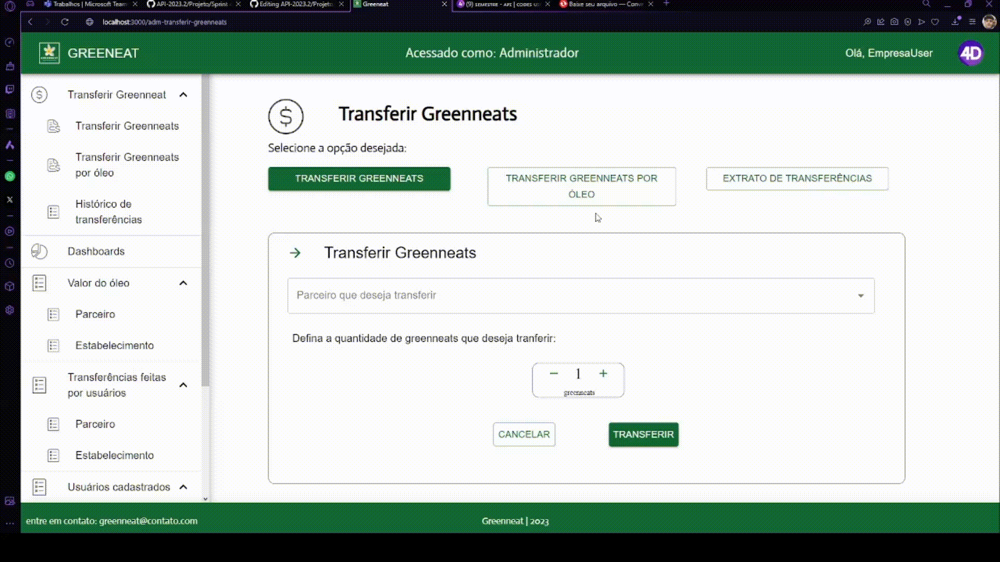
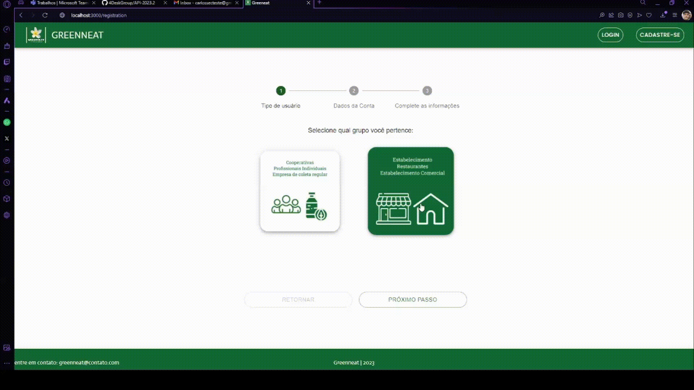
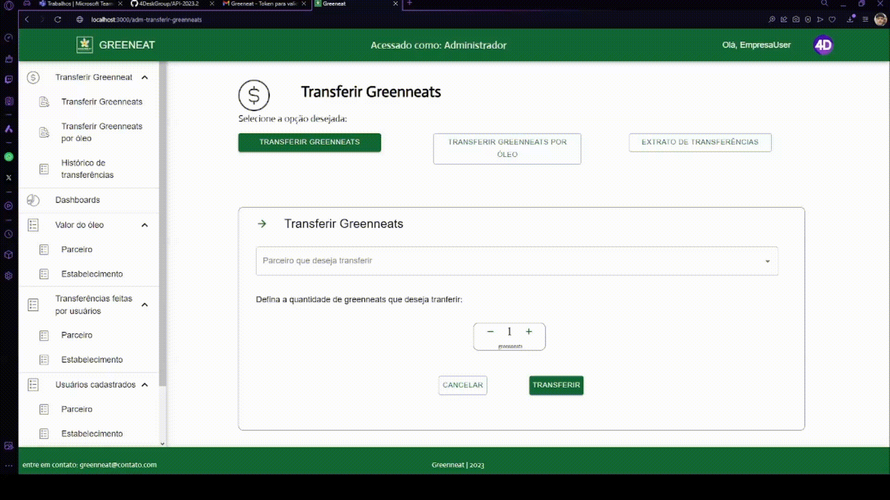

## Sprint 4 - Entrega de valor

## Resumo

 Nesta etapa final do projeto, foram realizados melhorias, sistema de parametrização do valor da moeda (Grenneat) por litro de óleo, e página de dashboard.

## Backlog do produto :bulb:
### Requisitos Funcionais

 • Administrador/Empresa parametrizar o valor do óleo em relação ao valor de greenneat (Empresa / Administrador). 

 • Dashboard de dados (Empresa / Administrador).  

 • Validação de email (Usuários / Cadastro).  

 • Páginas com entendimento mais fácil e simples (Administrador / Parceiro / Estabelecimento). 

### Requisitos Não-Funcionais

 • Desenvolver banco de dados para registrar informações inseridas no sistema. 

 • Desenvolver interfaces (front-end). 

 • Conexão do front-end com o back-end (Banco de dados receber e transmitir dados juntamente a aplicação em desenvolvimento). 

### Projeto em deploy:
#### https://greenneat-app.vercel.app

# 📉 Burndown

 

## User Storie: 👤:
[Baixe o arquivo XLSX](https://github.com/4DeskGroup/API-2023.2/blob/main/Projeto/Sprint%204/Gifs/User%20Story4%20API4SEM.xlsx)

## Modelo lógico banco de dados 🧩:

## Demonstração do cadastro (parametrização) do valor de óleo em relação a Grenneat(Moeda) (Empresa / Administrador) 💻:

## Demonstração do uso da parametrização do valor de óleo em relação a Grenneat(Moeda) (Empresa / Administrador) 💻:

## Demonstração da validação de E-mail (Usuários) 💻:

## Demonstração do dashboard (Empresa / Administrador) 💻:

